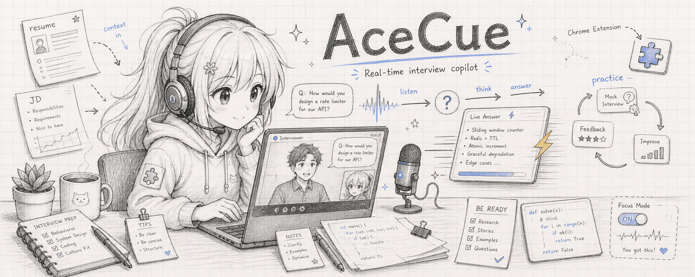

<div align="center">



# ▲ AceCue

**Your quiet edge in every interview.**

A real-time interview copilot. It listens, detects the interviewer's question, and streams a fast, tailored answer — live or in practice. Multi-model BYOK, guest-first, pure Vercel edge + a Chrome extension.

[English](#english) · [中文](#中文) · [日本語](#日本語) · [한국어](#한국어)

</div>

---

<a name="english"></a>
## English

### What it is
AceCue helps you prepare for and navigate interviews. It transcribes the conversation in real time, figures out when the interviewer has asked a question, and generates a concise answer tailored to your résumé and the job — in about a second.

It ships two ways:
- **Live Copilot (Chrome extension)** — captures your meeting tab's audio, detects questions, and floats a discreet answer window over Zoom/Meet/Teams.
- **Practice & web app** — no install. Run realistic mock interviews, configure your models, and rehearse. You can also go live in the browser by sharing your meeting tab's audio.

### Honest notes
- A browser extension **cannot hide itself from full-screen screen-sharing.** It stays private when you share a single tab, not your whole screen. We never pretend it's invisible.
- **Practice Mode is always 100% legitimate.** In live mode, treat AceCue like glancing at your own notes — some interviews prohibit assistance or are recorded. You decide what's appropriate.
- Built especially for non-native speakers, neurodivergent candidates, and anyone who interviews better with a little structure.

### Key features
- **Bring any model.** Paste one key — AceCue auto-detects the provider (OpenAI, Claude, Gemini, Groq, DeepSeek, Qwen, GLM, Kimi, MiniMax, Doubao, ERNIE, OpenRouter). Free tiers and your own paid keys both work.
- **Fast first token.** ⚡-flagged fast models (Groq, Gemini Flash, Claude Haiku) recommended for live mode.
- **Real-time STT.** Free browser speech recognition by default; bring a Deepgram key for low-latency, interviewer-only transcription via tab audio.
- **Tailored answers.** Your résumé + the job description are injected into every prompt (stored on your device).
- **Glance / Full modes**, opacity & font controls, hotkeys, panic-hide.
- **Practice mode** with an AI interviewer, STAR feedback, and a session summary.
- **4 languages** (EN / 中文 / 日本語 / 한국어) and **guest-first** — sign in only to sync across devices. Your API keys never sync.

### Quick start
```bash
npm install        # (no runtime deps; installs nothing required)
npm run dev         # serves public/ locally
```
Open the app, go to **Settings**, paste any model key, add your résumé + job description, then open **Live** or **Practice**. See [DEPLOY.md](DEPLOY.md) to put it on Vercel.

### Privacy
AceCue does not record or store your interviews. Audio is processed in your browser. BYOK keys live only in your browser's localStorage and are forwarded to the chosen provider for a single request — never logged or stored by us.

### Maker
Built by **Weiping** — [GitHub](https://github.com/appleweiping). *(Update contact details in `public/js/landing.js`.)*

---

<a name="中文"></a>
## 中文

### 这是什么
AceCue 帮你准备并应对面试。它实时转写对话，判断面试官何时问完问题，并在约一秒内生成贴合你简历与岗位的简洁回答。

提供两种形态：
- **实时副驾（Chrome 扩展）** —— 捕捉会议标签页的声音，识别问题，在 Zoom/Meet/Teams 上方用隐蔽的悬浮窗给出回答。
- **练习与网页端** —— 免安装。进行真实的模拟面试、配置模型、反复练习。也可在浏览器里通过共享会议标签页声音来实战。

### 诚实提醒
- 浏览器扩展**无法在「共享整个屏幕」时隐藏自己**。它只在你共享单个标签页时保持私密，而非整屏。我们从不假装隐形。
- **练习模式始终 100% 正当。** 实战模式下，请把 AceCue 当作瞥一眼自己的笔记 —— 有些面试禁止辅助或会录制。是否合适由你决定。
- 尤其为非母语者、神经多样性人群，以及任何需要一点结构化支撑的求职者打造。

### 核心功能
- **任选模型。** 粘贴一个密钥即自动识别提供商（OpenAI、Claude、Gemini、Groq、DeepSeek、通义千问、GLM、Kimi、MiniMax、豆包、文心、OpenRouter）。免费额度和自有付费密钥都支持。
- **首字极快。** 实战推荐带 ⚡ 的快速模型（Groq、Gemini Flash、Claude Haiku）。
- **实时语音转写。** 默认用免费的浏览器语音识别；填入 Deepgram 密钥即可通过标签页音频实现低延迟、仅面试官的转写。
- **定制回答。** 你的简历 + 职位描述会注入每个提示词（存储在你的设备上）。
- **速览 / 完整模式**、不透明度与字号调节、快捷键、一键隐藏。
- **练习模式**：AI 面试官、STAR 反馈、本次总结。
- **四种语言**（EN / 中文 / 日本語 / 한국어），**访客优先** —— 仅登录才跨设备同步。你的 API 密钥永不同步。

### 快速开始
```bash
npm install
npm run dev         # 本地启动 public/
```
打开应用 → **设置** → 粘贴任意模型密钥 → 填入简历与职位描述 → 打开 **实时** 或 **练习**。部署到 Vercel 见 [DEPLOY.md](DEPLOY.md)。

### 隐私
AceCue 不录制也不存储你的面试。音频在你的浏览器内处理。BYOK 密钥只存于浏览器 localStorage，仅在单次请求时转发给所选提供商 —— 我们绝不记录或存储。

### 制作人
由 **Weiping** 打造 —— [GitHub](https://github.com/appleweiping)。*（在 `public/js/landing.js` 中修改联系方式。）*

---

<a name="日本語"></a>
## 日本語

### これは何か
AceCue は面接の準備と本番を支援します。会話をリアルタイムで文字起こしし、面接官が質問し終えたタイミングを検知して、あなたの履歴書と求人に合わせた簡潔な回答を約1秒で生成します。

2つの形態:
- **ライブコパイロット（Chrome 拡張）** —— 会議タブの音声を取り込み、質問を検知し、Zoom/Meet/Teams の上に控えめなフローティングウィンドウで回答を表示。
- **練習 & ウェブアプリ** —— インストール不要。リアルな模擬面接、モデル設定、回答練習。会議タブの音声を共有すればブラウザでも本番利用可能。

### 正直なお知らせ
- ブラウザ拡張は**「画面全体の共有」中に自分を隠せません。** 単一タブの共有時のみ非表示を保てます。透明だとは決して偽りません。
- **練習モードは常に 100% 正当です。** 本番モードでは自分のメモをちらっと見る感覚で。録画や補助禁止の面接もあります。適切かどうかはあなたが判断します。
- 特に非ネイティブの方、ニューロダイバージェントの方、少しの構造で力を発揮できる方のために。

### 主な機能
- **どんなモデルでも。** キーを1つ貼ると提供元を自動検出（OpenAI, Claude, Gemini, Groq, DeepSeek, Qwen, GLM, Kimi, MiniMax, Doubao, ERNIE, OpenRouter）。無料枠も自分の有料キーも対応。
- **最初のトークンが速い。** 本番には ⚡ の高速モデル（Groq, Gemini Flash, Claude Haiku）を推奨。
- **リアルタイム文字起こし。** 既定は無料のブラウザ音声認識。Deepgram キーを使えばタブ音声で低遅延・面接官のみの文字起こし。
- **調整された回答。** 履歴書 + 求人内容を毎回プロンプトに注入（端末内に保存）。
- **要点 / 全文モード**、不透明度・文字サイズ調整、ショートカット、即時非表示。
- **練習モード**：AI 面接官、STAR フィードバック、セッション要約。
- **4言語**（EN / 中文 / 日本語 / 한국어）、**ゲスト優先** —— 同期はログイン時のみ。API キーは決して同期されません。

### クイックスタート
```bash
npm install
npm run dev         # public/ をローカル配信
```
アプリを開く → **設定** → 任意のモデルキーを貼る → 履歴書と求人を入力 → **ライブ** か **練習** を開く。Vercel へのデプロイは [DEPLOY.md](DEPLOY.md) を参照。

### プライバシー
AceCue は面接を録音も保存もしません。音声はブラウザ内で処理されます。BYOK キーはブラウザの localStorage のみに保存され、単一リクエストで選択した提供元にのみ転送されます —— 当方が記録・保存することはありません。

### 制作者
**Weiping** が制作 —— [GitHub](https://github.com/appleweiping)。*(連絡先は `public/js/landing.js` で変更。)*

---

<a name="한국어"></a>
## 한국어

### 무엇인가요
AceCue는 면접 준비와 실전을 돕습니다. 대화를 실시간으로 받아 적고, 면접관이 질문을 마친 시점을 감지해, 당신의 이력서와 채용공고에 맞춘 간결한 답을 약 1초 만에 생성합니다.

두 가지 형태:
- **실시간 코파일럿(Chrome 확장)** —— 회의 탭 오디오를 캡처하고 질문을 감지해 Zoom/Meet/Teams 위에 눈에 띄지 않는 플로팅 창으로 답을 보여줍니다.
- **연습 & 웹 앱** —— 설치 불필요. 현실적인 모의 면접, 모델 설정, 답변 연습. 회의 탭 오디오를 공유하면 브라우저에서도 실전 사용 가능.

### 솔직한 안내
- 브라우저 확장은 **'전체 화면 공유' 중에 자신을 숨길 수 없습니다.** 단일 탭을 공유할 때만 비공개로 유지됩니다. 결코 투명한 척하지 않습니다.
- **연습 모드는 언제나 100% 정당합니다.** 실전 모드에서는 자신의 메모를 슬쩍 보는 것처럼 쓰세요 —— 일부 면접은 보조를 금지하거나 녹화됩니다. 무엇이 적절한지는 당신이 결정합니다.
- 특히 비원어민, 신경다양성 지원자, 약간의 구조가 있으면 더 잘하는 모든 분을 위해.

### 주요 기능
- **어떤 모델이든.** 키 하나를 붙여넣으면 제공사 자동 감지(OpenAI, Claude, Gemini, Groq, DeepSeek, Qwen, GLM, Kimi, MiniMax, Doubao, ERNIE, OpenRouter). 무료 등급과 본인 유료 키 모두 지원.
- **빠른 첫 토큰.** 실전에는 ⚡ 빠른 모델(Groq, Gemini Flash, Claude Haiku) 권장.
- **실시간 STT.** 기본은 무료 브라우저 음성 인식. Deepgram 키를 쓰면 탭 오디오로 저지연·면접관 전용 받아쓰기.
- **맞춤 답변.** 이력서 + 채용공고를 매 프롬프트에 주입(기기에 저장).
- **요점 / 전체 모드**, 불투명도·글자 크기 조절, 단축키, 즉시 숨김.
- **연습 모드**: AI 면접관, STAR 피드백, 세션 요약.
- **4개 언어**(EN / 中文 / 日本語 / 한국어), **게스트 우선** —— 동기화는 로그인 시에만. API 키는 절대 동기화되지 않습니다.

### 빠른 시작
```bash
npm install
npm run dev         # public/ 로컬 서빙
```
앱 열기 → **설정** → 아무 모델 키 붙여넣기 → 이력서와 채용공고 입력 → **실시간** 또는 **연습** 열기. Vercel 배포는 [DEPLOY.md](DEPLOY.md) 참고.

### 개인정보
AceCue는 면접을 녹음하거나 저장하지 않습니다. 오디오는 브라우저에서 처리됩니다. BYOK 키는 브라우저 localStorage에만 저장되며 단일 요청 시 선택한 제공사에만 전달됩니다 —— 저희가 기록하거나 저장하지 않습니다.

### 제작자
**Weiping** 제작 —— [GitHub](https://github.com/appleweiping). *(연락처는 `public/js/landing.js`에서 수정.)*

---

<div align="center">

MIT License · © AceCue

</div>
